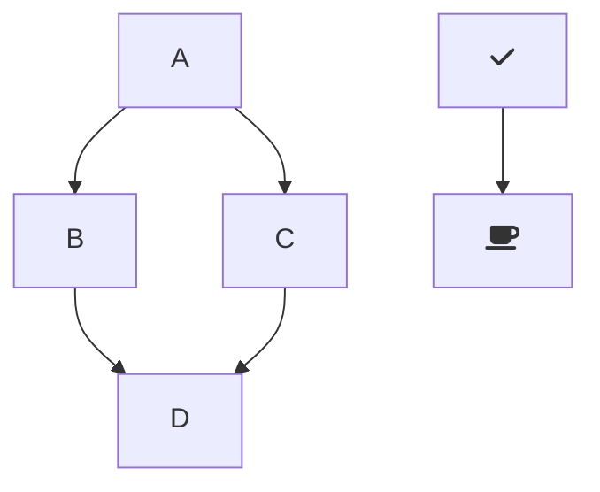

[[_TOC_]]

this sample was created to test my ablities on Node js
# packages that i used
here is the list of packages that i used 
[packages](./document.md)

# run and build
- npm run dev
- npm run build

# mermaid support

# run api examples 
install restclient extention
## switch environment
you can also switch environment using shortcut Ctrl+Alt+E(Cmd+Alt+E for macOS), or press F1 and then select/type Rest Client: Switch Environment.

## send request 
- open what ever *.http files and 
- click the Send Request link above the request (this will appear if the file's language mode is HTTP, by default .http files are like this), or use shortcut Ctrl+Alt+R(Cmd+Alt+R for macOS), or right-click in the editor and then select Send Request in the menu, or press F1 and then select/type Rest Client: Send Request, 

## refrence 
- for swagger with authentication compelete **ToDO**
 swagger autogen 
https://medium.com/@davibaltarx/documenta%C3%A7%C3%A3o-autom%C3%A1tica-de-apis-em-node-js-eb03041c643b
https://www.npmjs.com/package/swagger-autogen
 swagger jsdoc 
https://javascript.plainenglish.io/how-to-implement-and-use-swagger-in-nodejs-d0b95e765245

- mongo in node js 
https://www.mongodb.com/docs/realm/sdk/node/examples/query-mongodb/